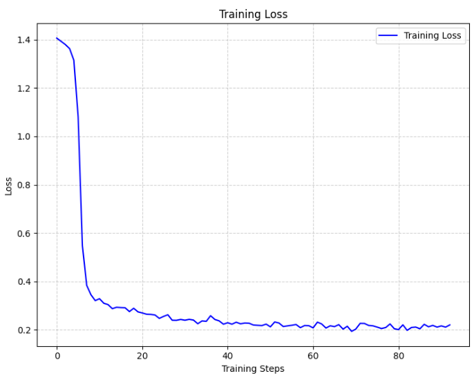
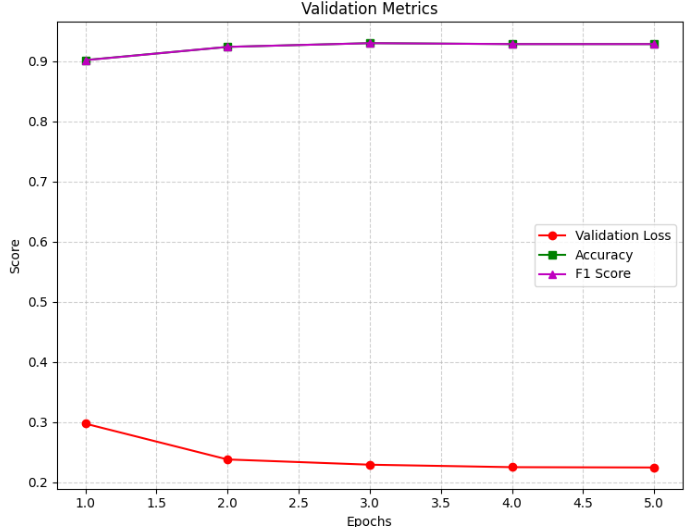
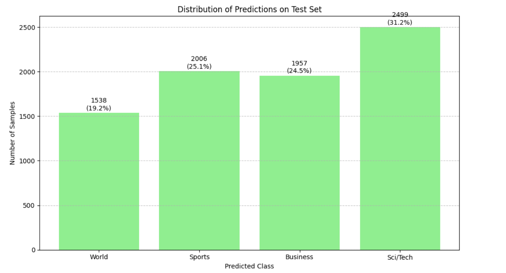

# Parameter-Efficient Fine-Tuning of RoBERTa with LoRA for AG News Classification

## Overview
This project implements an efficient text classification model on the AG News dataset using a fine-tuned RoBERTa model optimized with Low-Rank Adaptation (LoRA).  
The goal was to maximize inference accuracy while staying within a strict constraint of fewer than 1 million trainable parameters.

Our approach combined:
- **LoRA tuning** with modular adaptation across selected layers,
- **Knowledge Distillation** using fine-tuned and frozen teacher models,
- **Targeted Layer Adaptation** instead of uniform LoRA application.

Our best model achieved an **inference accuracy of 84.925%** under the parameter budget.

---

## Dataset
We used the [AG News Dataset](https://www.kaggle.com/datasets/amananandrai/ag-news-classification-dataset), which consists of:
- 120,000 training samples
- 7,600 test samples
- 4 classes: World, Sports, Business, Sci/Tech

Each sample includes a short news title and description.

---

## Methodology
Key techniques and configurations used:
- **LoRA Tuning**:  
  - Ranks (`r`) varied between 4 and 12.  
  - Scaling factors (`α`) varied between 16 and 32.  
- **Knowledge Distillation**:  
  - Teacher: Fine-tuned RoBERTa with rank=8, alpha=32.
  - Student: Rank=16, alpha=8 setup.
- **Targeted Adaptation**:  
  - LoRA applied selectively to layers 0, 1, 5, 10, and 11 (self-attention query/key projections and dense output layers).

Libraries:
- [Hugging Face Transformers](https://github.com/huggingface/transformers)
- [PEFT Library](https://github.com/huggingface/peft)

---

## Results

| Configuration                  | Parameters | Validation Accuracy | Inference Accuracy |
|---------------------------------|------------|----------------------|--------------------|
| LoRA only                       | 888,580    | 84.37%               | 82.07%             |
| LoRA + Distillation             | 925,444    | 88.90%               | 83.00%             |
| LoRA + Distillation (Reduced)   | 814,852    | 88.43%               | 84.30%             |
| LoRA + Distillation (Tuned)     | 888,580    | **89.22%**            | **84.90%**         |
| Targeted LoRA Modules           | 796,420    | **92.97%**            | 84.53%             |

We observed that selectively applying LoRA led to higher accuracy at a lower parameter cost.

---

## Training Progress

### Training Loss vs Epochs


### Validation Metrics


### Predictions Visualization


---

## Key Observations
- Validation accuracy alone does not always guarantee the best model for inference. Careful evaluation across different metrics is necessary.
- Selective layer adaptation significantly improved model efficiency.
- Knowledge distillation served as an effective regularizer to stabilize training.

---

## Future Work
- More granular control over adapter placement.
- Explore cross-layer attention sharing techniques.
- Integrate quantization methods like **QLoRA** for even greater parameter and memory efficiency.

---

## How to Run
1. Clone this repository:
    ```bash
    git clone https://github.com/nishant-ai/BERT-tuned-AGNews.git
    cd BERT-tuned-AGNews
    ```
    
2. Train or evaluate:
    - See provided notebooks and scripts in the repository.

3. Check `inference_output-submitted-final.csv` for final model predictions.

---

## Repository Contents
- `submission/`: Exploratory and tuning notebooks.
- `notebooks/`: Starter Notebook and Initial resources.
- `README.md`: Project overview (this file).
